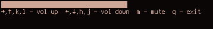

## i3-termdialogs

This was created as a test of FTXUI library in an attempt to create terminal-based dialogs for i3
use. It may be developed further in the future, it may not. :)

### Building

Building should be as simple as:

    mkdir build
    cd build
    cmake ..
    make

### Dialogs

#### volume

Dialog for increasing and decreasing volume. Example usage:

    urxvtc --geometry 60x2 --title floatme -e ./volume

Unfortunately for some reason either X11, uxvt or i3 forces the window to be slightly larger than expected. I've tried st as well, but the result is identical.
